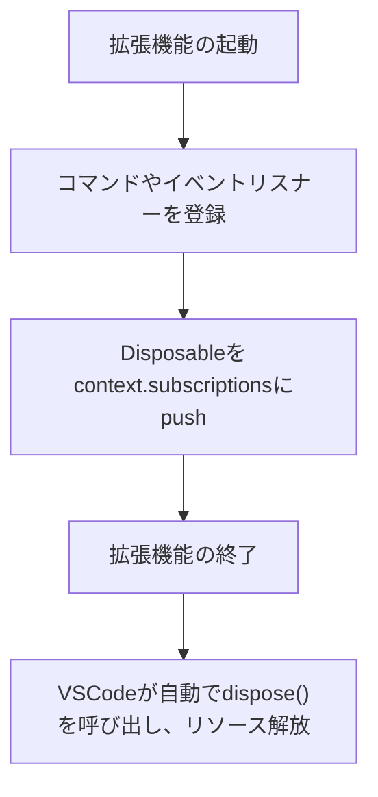

# VSCode拡張機能開発TIPS（ImageMarkPengent）

## Vscodeの起動イメージ




## よく使うAPI・ポイント

- `vscode.window.showInformationMessage('メッセージ')`
  - 右下に情報メッセージを表示できる。デバッグやユーザー通知に便利。

- `console.log('メッセージ')`
  - 拡張機能のデバッグ用ログ。VSCodeの「出力」→「拡張機能のログ」で確認できる。

- `vscode.commands.registerCommand('コマンドID', () => { ... })`
  - コマンドIDはpackage.jsonのcontributes.commandsで定義したものと一致させる必要がある。
  - コマンドの実装はこのコールバック内に記述。

- `context.subscriptions.push(オブジェクト)`
  - 登録したコマンドやイベントリスナーは、context.subscriptionsにpushしておくと拡張機能の終了時に自動でクリーンアップされる。
  - もう少しかみ砕くと拡張機能が無効化・アンロードされたときに、イベントリスナーやコマンドなどのリソースを自動で解放してくれるという意味です。
  - pushしない場合、拡張機能が終了してもコマンドやリスナーが残り続け、メモリリークや予期しない動作の原因になります。

- `activate(context: vscode.ExtensionContext)`
  - 拡張機能が有効化されたときに一度だけ呼ばれる初期化関数。

- `deactivate()`
  - 拡張機能が無効化されたときに呼ばれるクリーンアップ関数。

---

## その他
- コマンドの追加や変更を行った場合は、VSCodeの再起動や拡張機能の再読み込み（Reload）を行うと反映されやすい。

---

## コマンド登録と右クリックメニュー対応

### コマンドの登録

1. `package.json`にコマンドを登録する
2. contributes.commands に新しいコマンド（例: imagemarkpengent.openImageEditor）を追加
3. activationEvents にコマンドのonCommandイベントを追加
   * VSCode拡張機能が「いつ有効化（起動）」されるかを決めるトリガーを定義するものです。
   * VSCodeの拡張機能は、「VSCodeの起動時」や「特定のファイルを開いたとき」など、必要なタイミングで初めてメモリにロードされ、activate関数が呼ばれます。
  

| 設定値                  | 説明                                                         |
| ----------------------- | ------------------------------------------------------------ |
| "onCommand:コマンドID"  | 指定したコマンドが実行されたときに拡張機能を有効化           |
| "onLanguage:言語ID"     | 指定した言語のファイルが開かれたとき                         |
| "onFileSystem:スキーム" | 指定したファイルシステムスキームのリソースにアクセスしたとき |
| "*"                     | VSCode起動時に必ず有効化（非推奨：重くなるため）             |


```json
"activationEvents": [
  "onCommand:imagemarkpengent.openImageEditor"
],
"contributes": {
  "commands": [
    {
      "command": "imagemarkpengent.openImageEditor",
      "title": "Open in ImageMarkPengent"
    }
  ],
}
```

### 右クリックメニューに対応する

1. `package.json`にコマンドを登録する
2. contributes.menus に`explorer/context`を追加する
   * explorer/context は エクスプローラー（ファイルツリー）で右クリックしたときのコンテキストメニュー 
3. menuの内容を追加する
   * groupはメニュー内でのコマンドの表示位置を指定するためのグループ名です
     * "navigation": ファイルやフォルダをナビゲーション・開く

```json
"contributes": {
    "menus": {
        "explorer/context": [
            {
                "command": "imagemarkpengent.openImageEditor",
                "when": "resourceExtname =~ /\\.(png|jpg|jpeg)$/",
                "group": "navigation"
            }
        ]
    }    
}
```

### 対象拡張子を `.png` / `.jpg` / `.jpeg` に限定

基本的には、explorer/context メニューの when 句で拡張子を限定すれば十分ですが
「コマンドの実行自体を拡張子で制御したい」場合は、コマンド実装側でも拡張子チェックを行うのが安全です。

#### コマンド側の実装例


```js
vscode.commands.registerCommand('imagemarkpengent.openImageEditor', (uri: vscode.Uri) => {
  if (!uri || !uri.fsPath.match(/\.(png|jpg|jpeg)$/i)) {
    vscode.window.showWarningMessage('対応画像ファイル（.png, .jpg, .jpeg）を選択してください。');
    return;
  }
  // ここに画像編集処理
});
```

## デプロイ方法

VSCodeの拡張機能（extension）を実装した後、公開して他の人に使ってもらうには、主に以下の方法があります：

---

### ① **Visual Studio Code Marketplace に公開する（公式手順）**

👉 一般的・標準的な方法。VSCode本体からインストール可能になる。

#### 必要な準備

1. **Microsoftアカウント** と **Publisherアカウント登録**

* [Visual Studio Marketplace](https://marketplace.visualstudio.com/manage) で publisher を作成

1. **`vsce` CLIツール のインストール**

#### デプロイを実行する

```bash
npm install -g vsce
```


#### 公開手順

1. **パッケージ作成**

```bash
vsce package
```

`.vsix` ファイルが生成される（ローカル配布にも使える）

##### リンクエラーになった場合

```error
 ERROR  Couldn't detect the repository where this extension is published. The link './README.jp.md' will be broken in README.md. 
```
vsceが`package.json`に epositoryURLがないため、
README内のリンク解決ができないというエラーです。

GitHubやGitLabにリポジトリがある場合はrepositoryフィールドを入れるとOK。


2. **公開**

```bash
vsce publish
```

初回はアクセストークンが必要（Marketplace から取得）。

#### メリット

* 世界中のユーザーに簡単に配布
* 自動アップデート対応

